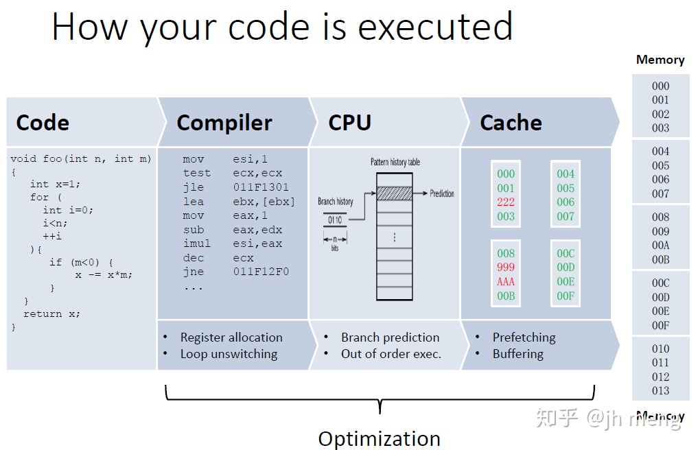

# 从缓存一致性到内存模型
## 顺序
- Program order: 在给定CPU上运行的代码中指定内存操作的顺序。 请注意，这是CPU看到的程序目标代码的顺序，由于编译器优化，它可能与源代码中的顺序不同。

- Execution order: 单个内存引用指令在给定CPU上执行的顺序。由于编译器和CPU实现优化，执行顺序可能与程序顺序不同。 

- Perceived order: 给定CPU感知其和其他CPU内存操作的顺序。 由于缓存、互连和内存系统优化，感知顺序可能与执行顺序不同。 

## Memory Consistency内存连贯性(前后一致)

## Cache Coherence缓存一致性

## C++原子操作
我们知道多核编程常常用锁避免多个线程修改同一个数据时产生race condition。当锁成为性能瓶颈时，我们又总想试着绕开它，而不可避免地接触到原子指令。C++11里面原子指令。
|                  原子指令(x均为std::atomic)              |                               作用                        |
| -----------------------------------------------------  | -------------------------------------------------------  |
| x.load()                                               |                      返回x的值                             |
| x.store(n)                                             |                      把x设为n，什么都不返回                  |
| x.exchange(n)                                          |                      把x设为n，返回设定之前的值               |
| x.compare_exchange_strong(expected_ref, desired)       |若x等于expected_ref,则设为desired,返回成功；否则把最新的值写入expected_ref, 返回失败 |
| x.compare_exchange_weak(expected_ref, desired)         | 相比compare_exchange_strong可能有伪唤醒(spurious wakeup)     |
| x.fetch_add(n)  x.fetch_sub(n)                         | 原子地做x += n，x -= n，返回修改之前的值。                     |