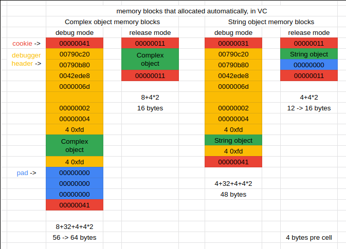
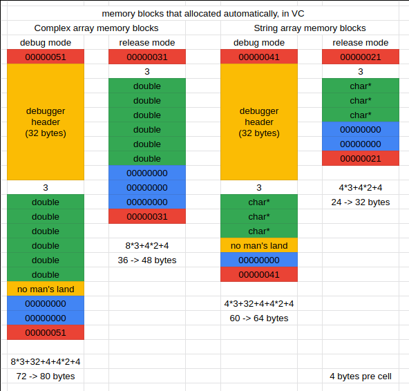

# Memory Management in C++

See complete codes in [complex.h](./code/complex.h) and [string.h](./code/string.h).

### About stack and heap

Memory in C++ programs is devided into two parts:

The stack, means a piece of memory space inside some scope. For exapmle, if you call a function, the function itself makes a stack to place its agruments, return address, local objects, and so on.

All objects declared inside the function will take up memory from the stack.

The heap, or system heap, is a global memory space offered by OS, which could be allocated dynamically, and get blocks from it.


```cpp
class Complex { ... };
...
{
  Complex c1(1, 2); // c1 takes up memory from stack

  Complex* p = new Complex(3); // Complex(3) is a temp object, takes up memory
                               //  from heap, which is allocated dynamically
			       //  by operator new
}

```

### Lifetime of objects

```cpp
class Complex { ... };
...
{
  Complex c1(1, 2);
  static Complex c2(1, 2);
}
Complex c3(1, 2);
{
  Complex* p = new Complex;
  ...
  delete p; // $1
}
```

c1 is a stack object, or local object, it dies when the scope finished. Also called as "auto object", for it will be released automatically.

c2 is a so-called "static object", its lifetime still lasts after the scope finished, till the program ended.

c3 is a global object, its lifetime lasts the whole program, could be treated as a kind of static object, the scope is the whole program.

p points at a heap object, which dies when deleted by operator delete. Commenting the entire $1 line will cause memory leak, 'cause when the scope finished, the heap object which p points at still exists, but p dies with the scope, and there will be no chance to relase the heap object outside the scope (or after p dies).

### new: allocate memory, then call constructor

```cpp
class Complex {
 public:
  Complex ( ... ) { ... }

 private:
  double m_real;
  double m_imag;
};

Complex* pc = new Complex(1, 2); // $2
```

The compiler will turn the $2 line into (not accurate, only indicative):

```cpp
Complex* pc; // $2-0

void* mem = operator new(sizeof(Complex)); // $2-1
pc = static_cast<Complex*>(mem); // $2-2
pc->Complex::Complex(1, 2); // $2-3
```

Line $2-1: the operator new calls malloc() (inside) to allocate a piece of Complex-sized memory;

Line $2-2: cast mem from a void\* pointer to a Complex\* pointer, assign to pc;

Line $2-3: pc calls constructor. Notice constructor is also a member function, it contains a hidden argument "this", which is pc here.

### delete: call destructor, then release memory

```cpp
class String {
 public:
  ~String () { delete [] m_data; }

 private:
  char* m_data;
};

String* ps = new String("Hello");
delete ps; // $3
```

The compiler devide line $3 to two steps:

```cpp
String::~String(ps);
operator delete(ps);
```

Notice that the operator delete, like the operator new, is a special function. The operator delete calls free() to release memory.

### memory blocks that allocated automatically, in VC

##### for objects:



Cookies are used to record the size of memory blocks, pad for, just paddinng, for the size of memory blocks must be a multiple of 16.

> Cookie: Why 00000041?
> 
> 40 is 64 in hex. VC sets the last bit to 0 or 1 to mean giving back or taking up memory.

##### for arrays:

```cpp
Complex* pc = new Complex[3];
String* ps = new String[3];
delete [] pc; // $4
delete [] ps; // $5
```



> VC adds an integer to record the count of items in arrays (3 in image).

Memory allocated by new [] must be released by delete [], or may cause memory leak.

delete [] in line $4 calls destructor 3 times to destruct 3 Complex objects in array, then the compiler will release the memory that the array took up.

Same behaviour the delete [] will cause in line $5, but if we replaced delete [] by delete:

The compiler will only call destructor one time, which means the "the-pointer-in-the-first-String-object-ponited-at" thing will be released correctly, but the second and the third one will not. After the compiler released the array, we wouldn't be able to release that two things, this causes memory leak.

Sure this affects nothing to the Complex array. But we should keep this habit: Use delete [] to relase memory allocated by new [].

[Next->](./02_static_members.md)
